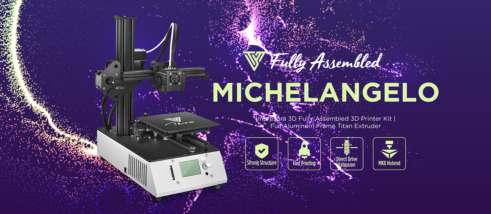

# Tevo Michelangelo 3D Printer

Welcome to the Github of the TEVO Michelangelo 3D printer - you find here the latest firmware & documents for your Michelangelo. Please take time and have detailed look at the infos provided on this page to be sure to update the correct firmware for your motherboard and version of 3d printer.

| Printer         | Michelangelo      |
| --------------- |:-----------------:|
| Motherboard     | MKS Gen L         |
| Firmware        | Marlin            |
| Actual Version  | T-MI-X.XXXX       |

## Introduction 

## Identify TEVO Michelangelo Motherboard 

## What version of TEVO Michelangelo do I have? 

## Important Infos

## Update TEVO Michelangelo Firmware - Preparation

## Update TEVO Michelangelo Firmware - Download

## Update TEVO Michelangelo Firmware - Drivers

## Update TEVO Michelangelo Firmware - Arduino

## Update TEVO Michelangelo Firmware - Flash Motherboard

## Testing

## Additional links

- [TEVO Michelangelo Infos](https://www.tevo.cn/products/3d-printers/tevo-michelangelo/ "TEVO Michelangelo Infos")
- [TEVO Michelangelo FAQ](https://help.tevo.cn/faq-categories/tevo-michelangelo/ "TEVO Michelangelo FAQ")

- [TEVO Website](https://www.tevo.cn/ "Visit TEVO Website")
- [TEVO Support](https://help.tevo.cn/ "Visit TEVO Support Suite")

- [TEVO Official Webshop](https://tevo3dprinterstore.com "Visit TEVO Official Webshop")
- [TEVO Aliexpress Shop](https://tevo.aliexpress.com/store/2010004 "Visit TEVO Aliexpress Shop")
- [TEVO Amazon Store](https://www.amazon.com/stores/node/9447801011 " Visit TEVO Amazon Store")

